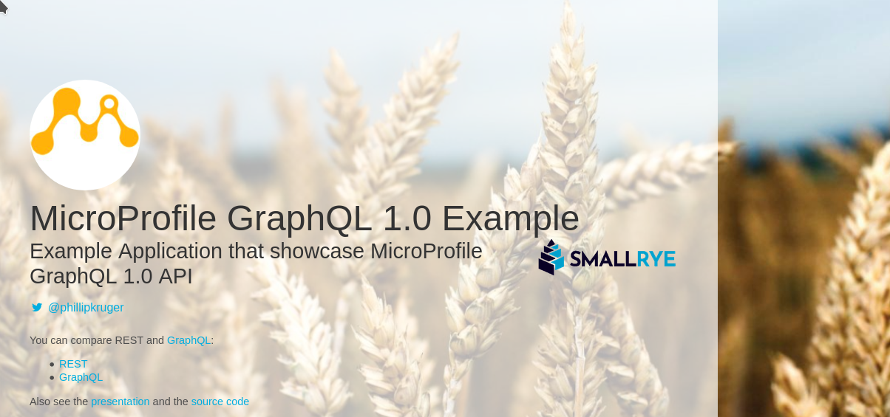
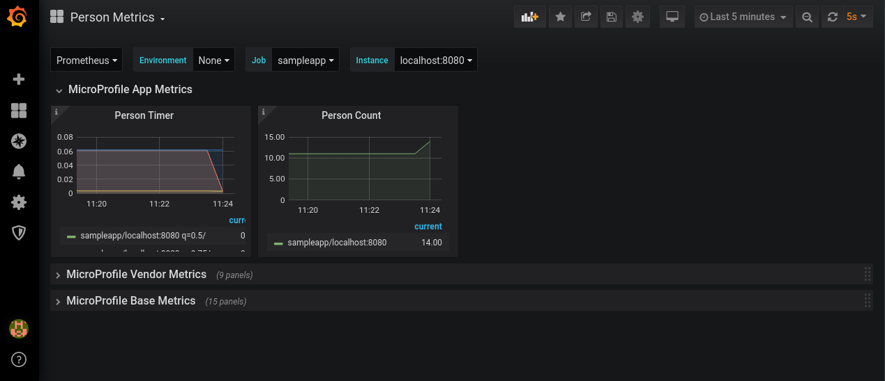
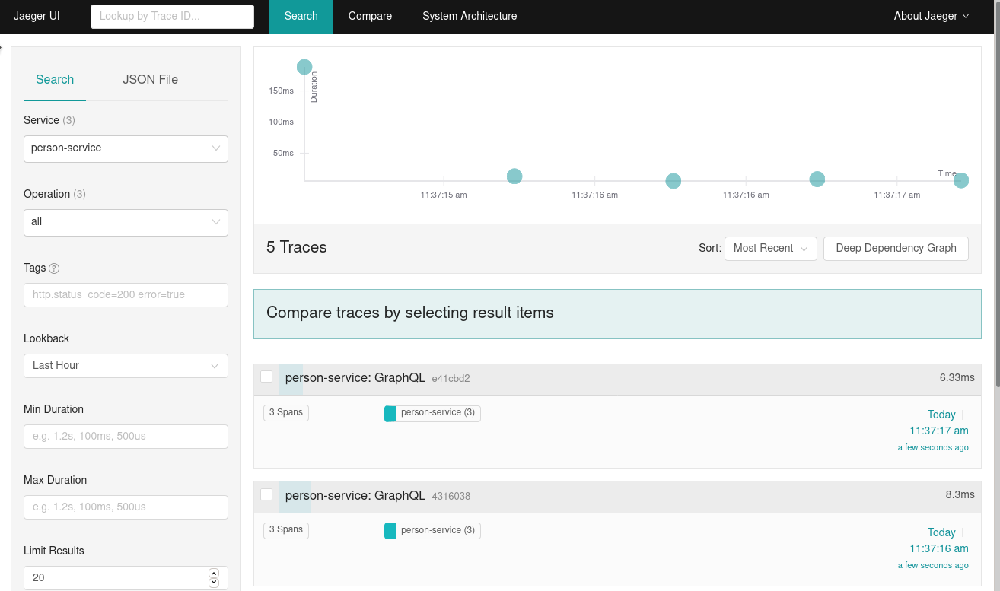
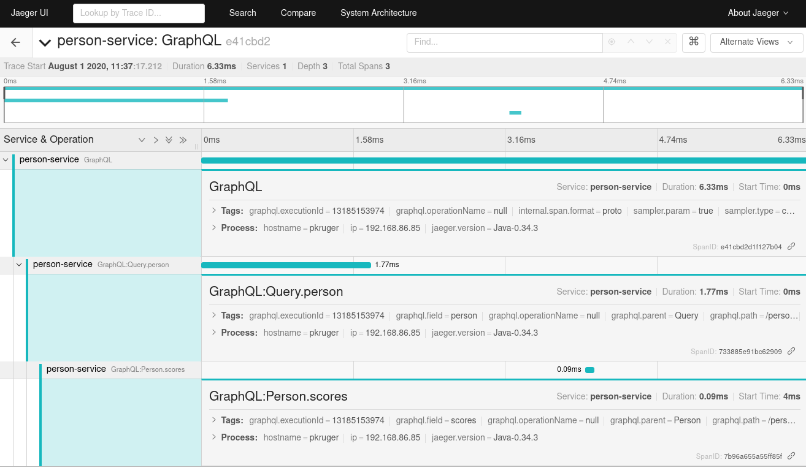

# MicroProfile GraphQL Example

This is an example of the [MicroProfile GraphQL API](https://github.com/eclipse/microprofile-graphql/) 
using the [SmallRye Implementation](https://github.com/smallrye/smallrye-graphql). It's done as part of these blog posts:

- [Supersonic Subatomic GraphQL](https://quarkus.io/blog/supersonic-subatomic-graphql/) 
- [Microprofile GraphQL Introduction](https://www.phillip-kruger.com/post/microprofile_graphql_introduction/)

and these [presentation](https://docs.google.com/presentation/d/1FCBw-qcjawBNNOSvqD7eJMUV96TwOL-4QyMkQAFt6tg/edit?usp=sharing)s: 

- Upcoming: Global Summit for Java devs'20
- [Quarkus Insights](https://www.youtube.com/watch?v=nMti8-zIDQs)
- [#OffTheChain](https://www.youtube.com/watch?v=OOTkQBCtYg0)
- [joziJUG](https://youtu.be/UqDdDYo-g-8)
- [SouJava](https://youtu.be/OOnpUeblVPM)
- [DevConf.cz](https://www.youtube.com/watch?v=lA0L7iB-GV8)
- [Java cloud conference](http://bit.ly/mp-graphql-presentation)

The services are exposed with both REST and GraphQL for comparison.

## Person example

This example expose person data as well as scores that the person got for certain activities.

### Running in Quarkus
(generate from https://code.quarkus.io/)

```
cd quarkus-example
mvn clean install quarkus:dev
```

### Running in Wildfly

```
cd wildfly-example
mvn clean install wildfly:run
```

This will start the application on port 8080.

## Testing

Go to http://localhost:8080 to test the application.

- Click on the 'REST' link to open Swagger UI to test the JAX-RS services.
- Click on the 'GraphQL' link to open GraphiQL UI to test the MicroProfile GraphQL service.

To stop the application, `ctrl-c` in the maven session.



### Examples

See the model in the JavaDoc (target/apidocs/index.html)

#### Demo 1 : MicroProfile GraphQL vs JAX-RS 

##### REST

Schema: http://localhost:8080/openapi

```
curl -X GET "http://localhost:8080/rest/profile/1" -H  "accept: application/json"
```

##### GraphQL

Schema: http://localhost:8080/graphql/schema.graphql

```
{
  person(id:1){
    names
    surname
  }
}
```

#### Demo 2: Stitching

```
{
  person(id:1){
    names
    surname
    scores{
      name
      value
    }
  }
}
```

in the log file:

```
======= Getting person [1] =======
======= Getting scores [512-46-5065] =======
```

without score

```
{
  person(id:1){
    names
    surname
  }
}
```

in the log file:

```
======= Getting person [1] =======
```

#### Demo 3: Batch

```
{
  people{
    names
    scores{
      name
    }
  }
}
```
in the log file:

```
======= Getting scores [797-95-4822, 373-95-3047, 097-87-6795, 347-01-8880, 733-86-4423, 560-99-2165, 091-07-5401, 539-70-2014, 029-18-5986, 287-58-0690] =======
```

#### Demo 4: More than one request

```
{
  person1:person(id:1){
    surname
    scores{
      name
      value
    }
  }
  person2:person(id:2){
    surname
  }
}
```

or more than one query:

```
@Query
public Integer getRandomNumber(long seed){
    Random random = new Random(seed);
    return random.nextInt();
}
```

```
{
  person1:person(id:1){
    surname
    scores{
      name
      value
    }
  }
  randomId:randomNumber(seed:11)
}
```


#### Demo 5: Collections

```
{
  people {
    surname
  }
}
```

#### Demo 6: JsonB Annotations support

```
{
  person(id:1){
     surname
     birthDate
  }
}
```

#### Demo 7: DefaultValue

```
@Query
public List<Person> getPersonsWithSurname(
        @DefaultValue("Doyle") String surname) {
    return personService.getPeopleWithSurname(surname);
}
```

Providing a parameter

```
{
  personsWithSurname(surname:"Hyatt") {
    names
  }
}
```

Uing the default

```
{
  personsWithSurname {
    names
  }
}
```

#### Demo 8: Errors and partial responses

##### Validation Errors

```
{
  person(id:1){
     surname
     scores{
      thisDoesNotExist
    }
  }
}
```

##### Partial results

```
{
  person(id:1){
     surname
     scores{
      name
      value
    }
  }
}
```

#### Demo 9: Metrics and Tracing

##### Servers

This will be specific to your setup. For me:

**Start Prometheus:**
```
cd /opt/Metrics/prometheus-2.19.2.linux-amd64
./prometheus --config.file=prometheus.yml
```
(prometheus.yml is in the root folder)

**Start Grafana:**
```
sudo systemctl start grafana-server
```
(grafana.json is in the root folder)

**Start Jaeger:**
```
docker run -p 5775:5775/udp -p 6831:6831/udp -p 6832:6832/udp -p 5778:5778 -p 16686:16686 -p 14268:14268 jaegertracing/all-in-one:latest
``` 

##### Metrics

```
@Timed(name = "personTimer", description = "How long does it take to get a Person.", unit = MetricUnits.NANOSECONDS)
@Counted(name = "personCount", description = "How many times did we ask for Person.")
```

[Grafana Dashboard](http://localhost:3000/d/T2kbtqZGk/person-metrics?orgId=1&refresh=5s)



##### Tracing

[Jaeger Dashboard](http://localhost:16686/search)




#### Demo 10: Security

```
@RolesAllowed("admin")
```

#### Demo 11: Bean validation

```
@Query
public Integer getRandomNumber(@Min(10) long seed){
    Random random = new Random(seed);
    return random.nextInt();
}
```

```
{
  randomNumber(seed:9)
}
```

#### Demo 12: Mutations

```
    @Mutation
    public Person updatePerson(Person person){
        return personService.updateOrCreate(person);
    }
    
    @Mutation
    public Person deletePerson(Long id){
        return personService.delete(id);
    }
```

##### Create
```
mutation CreatePerson{
  updatePerson(person : 
    {
      names: "Phillip"
    }
  ){
    id
    names
    surname
    profilePictures
    website
  }
}
```

##### Update 

(using the generated id)

```
mutation UpdatePerson{
  updatePerson(person : 
    {
      id: 11, 
      names:"Phillip",
      surname: "Kruger", 
      profilePictures: [
        "https://pbs.twimg.com/profile_images/1170690050524405762/I8KJ_hF4_400x400.jpg"
      ],
      website: "http://www.phillip-kruger.com"
    }){
    id
    names
    surname
    profilePictures
    website
  }
}
```

##### Delete

(using the id)

```
mutation DeletePerson{
  deletePerson(id :11){
    id
    surname
  }
}
```

#### Demo 13: Context (Experimental)

```
quarkus.hibernate-orm.log.sql=true
```

```
@Inject
Context context;

JsonArray selectedFields = context.getSelectedFields();
System.out.println("selectedFields [" + selectedFields +"]");

```


```
{
  people{
    surname
  }
}
```

#### Demo 14: Client (Future)

See the model in the JavaDoc (target/apidocs/index.html)

```
//@Inject
PersonGraphQLClient graphQLClient = GraphQlClientBuilder.newBuilder().build(PersonGraphQLClient.class);
```

```
Person graphQLPerson = graphQLClient.getPerson(id);
        
System.err.println("================ GRAPHQL ================");
System.err.println(graphQLPerson);
```
#### Apendix: Introspection

```
{
  __schema{
    types {
      name
      kind
    }
  }
}
 
```

#### The Introspection query used by GrapiQL

```
query IntrospectionQuery {
  __schema {
    queryType { name }
    mutationType { name }
    subscriptionType { name }
    types {
      ...FullType
    }
    directives {
      name
      description
      locations
      args {
        ...InputValue
      }
    }
  }
}

fragment FullType on __Type {
  kind
  name
  description
  fields(includeDeprecated: true) {
    name
    description
    args {
      ...InputValue
    }
    type {
      ...TypeRef
    }
    isDeprecated
    deprecationReason
  }
  inputFields {
    ...InputValue
  }
  interfaces {
    ...TypeRef
  }
  enumValues(includeDeprecated: true) {
    name
    description
    isDeprecated
    deprecationReason
  }
  possibleTypes {
    ...TypeRef
  }
}

fragment InputValue on __InputValue {
  name
  description
  type { ...TypeRef }
  defaultValue
}

fragment TypeRef on __Type {
  kind
  name
  ofType {
    kind
    name
    ofType {
      kind
      name
      ofType {
        kind
        name
        ofType {
          kind
          name
          ofType {
            kind
            name
            ofType {
              kind
              name
              ofType {
                kind
                name
              }
            }
          }
        }
      }
    }
  }
}
```

### Schemas

- REST: http://localhost:8080/openapi
- GraphQL: http://localhost:8080/graphql/schema.graphql